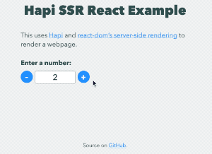

# Hapi SSR React Example

An example server with [Hapi](https://hapijs.com/) and [React server-side rendering](https://reactjs.org/docs/react-dom-server.html) with [React client-side hydration](https://reactjs.org/docs/react-dom.html#hydrate).



## Running

1. Install dependencies: `npm install`
2. Build the project: `npm run build`
3. Start the server: `npm start`
4. Open [localhost:3000](http://localhost:3000) in a browser

## Performance

Front-end bundle size:

```shell
$ du -h public/bundle.js
116K	public/bundle.js
```

Start time (macOS 10.14, 2.9 GHz Intel Core i7, 16 GB RAM) using [`performance.now()`](https://nodejs.org/api/perf_hooks.html#perf_hooks_performance_now): average `294 ms`

Locally testing the server responses with [loadtest](https://www.npmjs.com/package/loadtest):

* Response time for non-concurrent requests: `22 ms`

    ```shell
    $ loadtest -n 1000 http://localhost:3000
    [Sun Nov 18 2018 15:56:00 GMT-0800 (Pacific Standard Time)] INFO Requests: 0 (0%), requests per second: 0, mean latency: 0 ms
    [Sun Nov 18 2018 15:56:02 GMT-0800 (Pacific Standard Time)] INFO
    [Sun Nov 18 2018 15:56:02 GMT-0800 (Pacific Standard Time)] INFO Target URL:          http://localhost:3000
    [Sun Nov 18 2018 15:56:02 GMT-0800 (Pacific Standard Time)] INFO Max requests:        1000
    [Sun Nov 18 2018 15:56:02 GMT-0800 (Pacific Standard Time)] INFO Concurrency level:   1
    [Sun Nov 18 2018 15:56:02 GMT-0800 (Pacific Standard Time)] INFO Agent:               none
    [Sun Nov 18 2018 15:56:02 GMT-0800 (Pacific Standard Time)] INFO
    [Sun Nov 18 2018 15:56:02 GMT-0800 (Pacific Standard Time)] INFO Completed requests:  1000
    [Sun Nov 18 2018 15:56:02 GMT-0800 (Pacific Standard Time)] INFO Total errors:        0
    [Sun Nov 18 2018 15:56:02 GMT-0800 (Pacific Standard Time)] INFO Total time:          2.093387677 s
    [Sun Nov 18 2018 15:56:02 GMT-0800 (Pacific Standard Time)] INFO Requests per second: 478
    [Sun Nov 18 2018 15:56:02 GMT-0800 (Pacific Standard Time)] INFO Mean latency:        2.1 ms
    [Sun Nov 18 2018 15:56:02 GMT-0800 (Pacific Standard Time)] INFO
    [Sun Nov 18 2018 15:56:02 GMT-0800 (Pacific Standard Time)] INFO Percentage of the requests served within a certain time
    [Sun Nov 18 2018 15:56:02 GMT-0800 (Pacific Standard Time)] INFO   50%      1 ms
    [Sun Nov 18 2018 15:56:02 GMT-0800 (Pacific Standard Time)] INFO   90%      2 ms
    [Sun Nov 18 2018 15:56:02 GMT-0800 (Pacific Standard Time)] INFO   95%      2 ms
    [Sun Nov 18 2018 15:56:02 GMT-0800 (Pacific Standard Time)] INFO   99%      4 ms
    [Sun Nov 18 2018 15:56:02 GMT-0800 (Pacific Standard Time)] INFO  100%      22 ms (longest request)
    ```
* Response time for 10 concurrent requests: `35 ms`

    ```shell
    $ loadtest -n 1000 -c 10 http://localhost:3000
    [Sun Nov 18 2018 15:56:19 GMT-0800 (Pacific Standard Time)] INFO Requests: 0 (0%), requests per second: 0, mean latency: 0 ms
    [Sun Nov 18 2018 15:56:21 GMT-0800 (Pacific Standard Time)] INFO
    [Sun Nov 18 2018 15:56:21 GMT-0800 (Pacific Standard Time)] INFO Target URL:          http://localhost:3000
    [Sun Nov 18 2018 15:56:21 GMT-0800 (Pacific Standard Time)] INFO Max requests:        1000
    [Sun Nov 18 2018 15:56:21 GMT-0800 (Pacific Standard Time)] INFO Concurrency level:   10
    [Sun Nov 18 2018 15:56:21 GMT-0800 (Pacific Standard Time)] INFO Agent:               none
    [Sun Nov 18 2018 15:56:21 GMT-0800 (Pacific Standard Time)] INFO
    [Sun Nov 18 2018 15:56:21 GMT-0800 (Pacific Standard Time)] INFO Completed requests:  1000
    [Sun Nov 18 2018 15:56:21 GMT-0800 (Pacific Standard Time)] INFO Total errors:        0
    [Sun Nov 18 2018 15:56:21 GMT-0800 (Pacific Standard Time)] INFO Total time:          1.570349896 s
    [Sun Nov 18 2018 15:56:21 GMT-0800 (Pacific Standard Time)] INFO Requests per second: 637
    [Sun Nov 18 2018 15:56:21 GMT-0800 (Pacific Standard Time)] INFO Mean latency:        15.4 ms
    [Sun Nov 18 2018 15:56:21 GMT-0800 (Pacific Standard Time)] INFO
    [Sun Nov 18 2018 15:56:21 GMT-0800 (Pacific Standard Time)] INFO Percentage of the requests served within a certain time
    [Sun Nov 18 2018 15:56:21 GMT-0800 (Pacific Standard Time)] INFO   50%      14 ms
    [Sun Nov 18 2018 15:56:21 GMT-0800 (Pacific Standard Time)] INFO   90%      19 ms
    [Sun Nov 18 2018 15:56:21 GMT-0800 (Pacific Standard Time)] INFO   95%      21 ms
    [Sun Nov 18 2018 15:56:21 GMT-0800 (Pacific Standard Time)] INFO   99%      25 ms
    [Sun Nov 18 2018 15:56:21 GMT-0800 (Pacific Standard Time)] INFO  100%      35 ms (longest request)
    ```
* Response time for 100 concurrent requests: `285 ms`

    ```shell
    $ loadtest -n 1000 -c 100 http://localhost:3000
    [Sun Nov 18 2018 15:57:14 GMT-0800 (Pacific Standard Time)] INFO Requests: 0 (0%), requests per second: 0, mean latency: 0 ms
    [Sun Nov 18 2018 15:57:17 GMT-0800 (Pacific Standard Time)] INFO
    [Sun Nov 18 2018 15:57:17 GMT-0800 (Pacific Standard Time)] INFO Target URL:          http://localhost:3000
    [Sun Nov 18 2018 15:57:17 GMT-0800 (Pacific Standard Time)] INFO Max requests:        1000
    [Sun Nov 18 2018 15:57:17 GMT-0800 (Pacific Standard Time)] INFO Concurrency level:   100
    [Sun Nov 18 2018 15:57:17 GMT-0800 (Pacific Standard Time)] INFO Agent:               none
    [Sun Nov 18 2018 15:57:17 GMT-0800 (Pacific Standard Time)] INFO
    [Sun Nov 18 2018 15:57:17 GMT-0800 (Pacific Standard Time)] INFO Completed requests:  1000
    [Sun Nov 18 2018 15:57:17 GMT-0800 (Pacific Standard Time)] INFO Total errors:        0
    [Sun Nov 18 2018 15:57:17 GMT-0800 (Pacific Standard Time)] INFO Total time:          2.3342520020000004 s
    [Sun Nov 18 2018 15:57:17 GMT-0800 (Pacific Standard Time)] INFO Requests per second: 428
    [Sun Nov 18 2018 15:57:17 GMT-0800 (Pacific Standard Time)] INFO Mean latency:        224.1 ms
    [Sun Nov 18 2018 15:57:17 GMT-0800 (Pacific Standard Time)] INFO
    [Sun Nov 18 2018 15:57:17 GMT-0800 (Pacific Standard Time)] INFO Percentage of the requests served within a certain time
    [Sun Nov 18 2018 15:57:17 GMT-0800 (Pacific Standard Time)] INFO   50%      225 ms
    [Sun Nov 18 2018 15:57:17 GMT-0800 (Pacific Standard Time)] INFO   90%      251 ms
    [Sun Nov 18 2018 15:57:17 GMT-0800 (Pacific Standard Time)] INFO   95%      259 ms
    [Sun Nov 18 2018 15:57:17 GMT-0800 (Pacific Standard Time)] INFO   99%      285 ms
    [Sun Nov 18 2018 15:57:17 GMT-0800 (Pacific Standard Time)] INFO  100%      285 ms (longest request)
    ```
